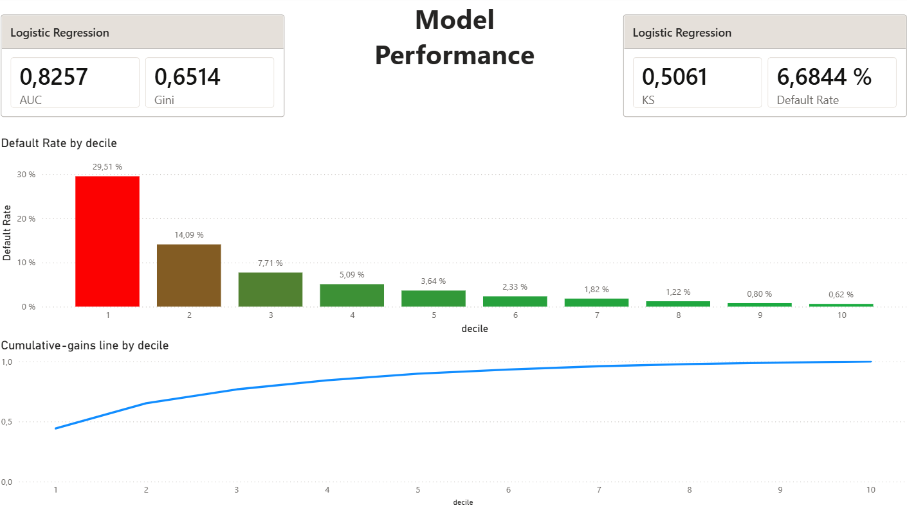
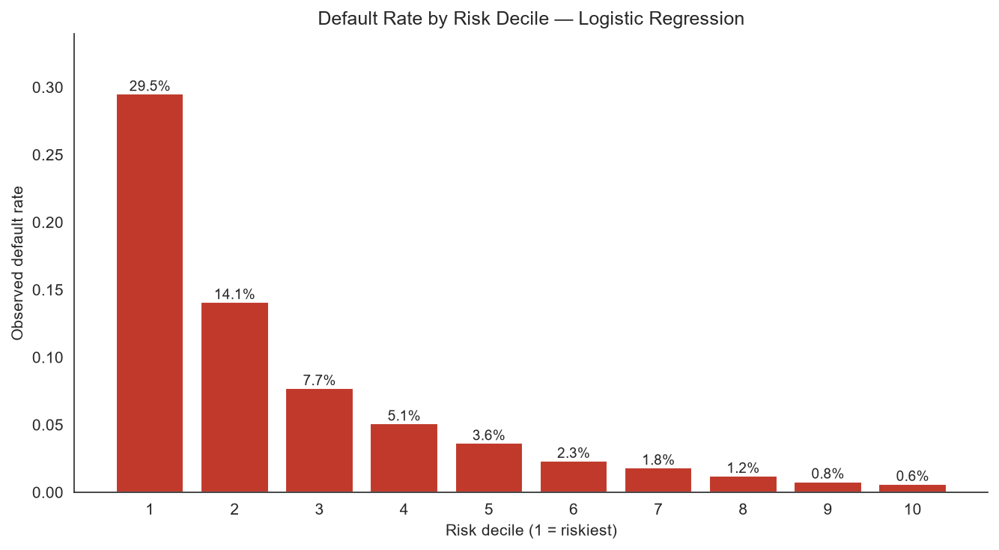
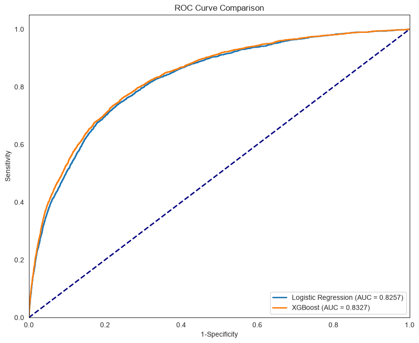
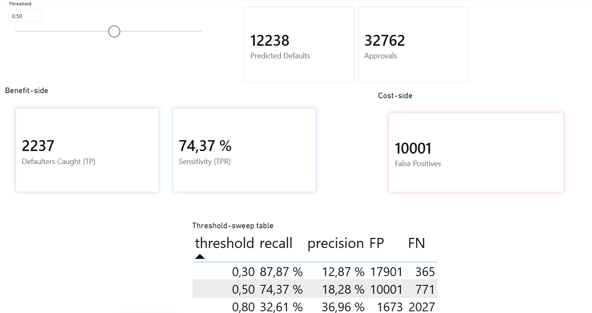
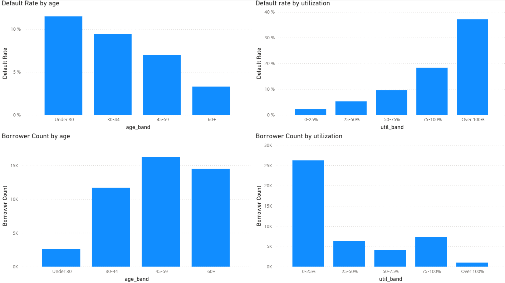

# Credit Risk PD Model — Probability of Default Scoring

A production-style **Probability of Default (PD)** credit scoring model built on the Kaggle *Give Me Some Credit* dataset. The project pairs an interpretable **logistic regression** (the production scorecard) with an **XGBoost challenger**, evaluates both on the metrics a credit risk team actually reports (AUC, Gini, KS, decile gains), and presents the results in an interactive **Power BI** dashboard.

> **Live interactive dashboard:** [Open in Power BI](https://app.powerbi.com/view?r=eyJrIjoiNDUxNjczNjktYTE4Ni00NDY1LTkxMTEtNTRkMDAxMjI2NGZkIiwidCI6IjI1Y2UwMjYxLWJiZDYtNDljZC1hMWUyLTU0MjYwODg2ZDE1OSJ9)
> A static export is also available at [`reports/CreditRisk_PD_Dashboard.pdf`](reports/CreditRisk_PD_Dashboard.pdf).



---

## Business context

Lenders must estimate the **probability that a borrower defaults** within a given horizon. This PD estimate is the foundation of credit decisioning and of regulatory frameworks such as **IFRS 9** (expected credit loss provisioning) and **Basel III** (regulatory capital). A good PD model does two things: it **ranks** borrowers by risk (discrimination) and it produces **defensible, explainable** scores that a regulator and a credit committee can scrutinise.

This project models PD on a portfolio of 150,000 borrowers with a **6.7% default rate**, deliberately scoped to PD only (LGD/EAD are reserved for a follow-up project).

---

## Headline results

| Model | AUC | Gini | KS |
|---|---|---|---|
| **Logistic Regression** (production) | 0.826 | 0.651 | 0.506 |
| XGBoost (challenger) | 0.833 | 0.665 | 0.516 |

**In business terms:** ranking borrowers by predicted PD and splitting into deciles, the **riskiest 10% of borrowers default at 29.5%** — a **4.4× lift** over the 6.7% portfolio average — and the **riskiest 30% capture 77% of all defaults**. A credit team reviewing only the top three risk deciles would catch over three-quarters of future defaulters.



The two models are nearly indistinguishable in ranking power (a ~0.007 AUC gap). Because that gap is negligible, the **interpretable logistic regression is the production choice**, with XGBoost retained as a challenger that confirms how little nonlinear signal is left on the table.

---

## Why logistic regression for production

This is a deliberate, regulatory-aware decision rather than a modelling shortcut:

- **Interpretability** — every coefficient converts to a defensible **odds ratio** (see below). A credit committee can read exactly how each feature moves risk.
- **Regulatory acceptance** — supervisors (ECB/NBB) expect transparent, documentable PD models. A logistic scorecard is the industry default.
- **Stability and monitoring** — a linear scorecard is straightforward to validate and to track for drift over time.
- **Negligible cost** — XGBoost's ~0.007 AUC edge does not justify sacrificing interpretability.

XGBoost earns its place as a **challenger**: its small advantage is concentrated in the riskiest decile, quantifying the nonlinear structure (e.g. the non-monotonic effect of credit utilisation at the low end) that a linear model cannot capture.

---

## Model interpretation — odds ratios

Logistic regression coefficients are reported as **odds ratios** (per 1 standard deviation, since features are standardised). An odds ratio above 1 increases default odds; below 1 is protective.

| Feature | Odds ratio | Reading (per 1 SD) |
|---|---|---|
| Revolving utilisation | 2.33 | **+133%** odds — strongest driver |
| 30–59 days past due | 1.85 | +85% odds |
| Open credit lines & loans | 1.10 | +10% odds |
| Real estate loans/lines | 1.06 | +6% odds |
| Dependents | 1.05 | +5% odds |
| Debt ratio | 1.06 | +6% odds |
| Age | 0.74 | **−26%** odds — protective (older = safer) |

All signs are economically sensible, and all coefficients are statistically significant (Wald test, large-sample). This signed, defensible structure is exactly what a regulator expects from a scorecard.

---

## Methodology

### Data preparation
- **Sentinel codes** (96/98 in the past-due columns) were shown to default at 54.6% vs. the 6.7% baseline, then capped at each column's legitimate maximum.
- **Invalid values** (e.g. `age == 0`) corrected; extreme outliers in utilisation and debt ratio winsorised, with the debt-ratio cap derived from the income-present subset after diagnosing contamination from missing income.
- **Missing income** (~20%) was flag-tested with Weight of Evidence / Information Value (IV = 0.008, below the useful threshold), then median-imputed and log-transformed.
- **Feature selection** removed redundant features: one of three near-collinear past-due columns, a sentinel flag that produced a wrong-signed coefficient (a textbook multicollinearity symptom), and an income feature that was insignificant under the Wald test — each removed at near-zero AUC cost.

### Models
- **Logistic Regression** — standardised features (fit on train only to prevent leakage), `class_weight="balanced"` for the 6.7% imbalance.
- **XGBoost** — trained on unscaled features (trees are scale-invariant), with `scale_pos_weight` for imbalance.

### Evaluation
Both models are compared on AUC, Gini, and KS; ROC curves; **decile gains tables** (default rate, lift, cumulative capture); and a **threshold sweep** that makes the precision/recall trade-off explicit. Because of the 6.7% imbalance, **accuracy is deliberately not used** — a model approving everyone would score 93% accuracy while catching zero defaulters.



The operating threshold is treated as a **business decision**, not a statistical one: in lending a missed defaulter (lost principal) typically costs far more than a wrongly declined applicant (lost margin), which argues for a lower threshold and higher recall — calibrated to the institution's cost ratio rather than to F1.

---

## Interactive dashboard

The Power BI report has three pages:

1. **Model Performance** — KPI cards (AUC, Gini, KS, portfolio default rate), the decile default-rate chart, and the cumulative-gains (CAP) curve.
2. **Risk Segmentation** — a **live threshold slider** driving real-time cards for approvals, declines, defaulters caught, sensitivity, and false positives, alongside the threshold-sweep table. This makes the operating-point trade-off tangible for a credit manager.
3. **Portfolio Profile** — default rate and borrower count by age band and utilisation band, showing where risk concentrates and how much of the book each segment represents.





---

## Tech stack

- **Python 3.11** — pandas, NumPy, scikit-learn, statsmodels, XGBoost
- **Statistical modelling** — logistic regression (sklearn + statsmodels for inference), Weight of Evidence / Information Value, VIF, Wald tests
- **Visualisation** — matplotlib, seaborn
- **BI** — Power BI (DAX measures, what-if parameters, Power Query)
- **Environment** — Anaconda / conda (`credit-risk`), VS Code, Jupyter

---

## Repository structure

```
.
├── data/
│   └── cs-training.csv            # Kaggle "Give Me Some Credit" training data
├── notebooks/
│   └── credit_risk_pd_model.ipynb # full analysis: cleaning → modelling → evaluation
├── reports/
│   ├── figures/                   # exported charts (ROC, decile gains, etc.)
│   ├── powerbi/                   # scored data + gains/sweep tables for the dashboard
│   └── CreditRisk_PD_Dashboard.pdf
├── src/                           # reusable functions (cleaning, WoE/IV, gains table)
├── requirements.txt
└── README.md
```

---

## How to run

```bash
# 1. Create and activate the environment
conda create -n credit-risk python=3.11
conda activate credit-risk

# 2. Install dependencies
pip install -r requirements.txt

# 3. Launch the notebook
jupyter notebook notebooks/credit_risk_pd_model.ipynb
```

The Power BI file (`.pbix`) is excluded from the repository (large binary); the dashboard is available via the live link above and as a PDF in `reports/`.

---

## Next steps

- **SHAP values** for model-agnostic interpretation of the XGBoost challenger.
- **Probability calibration** (calibration curves, Hosmer–Lemeshow) — discrimination is validated here; calibration of the PD *levels* is the natural complement.
- **LGD and EAD modelling** in a follow-up project, enabling full **Expected Credit Loss** (ECL = PD × LGD × EAD) estimation.
- **Out-of-time validation** to assess stability and drift on a later period.

---

## Data source & disclaimer

Data: Kaggle [*Give Me Some Credit*](https://www.kaggle.com/c/GiveMeSomeCredit) competition (synthetic/anonymised consumer credit data). This project is for portfolio and educational purposes and does not constitute a deployed credit decisioning system.
